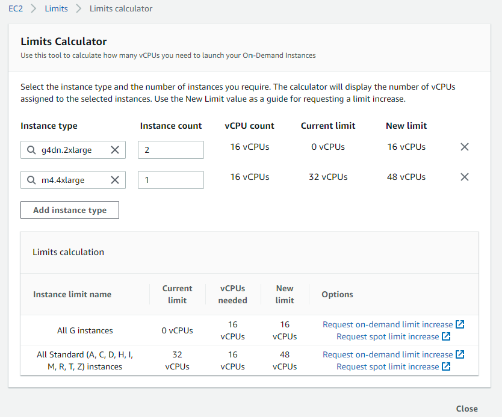

## Launching a Spark GPU Cluster via AWS EMR

In order to launch a Spark GPU cluster via AWS EMR (and interact with it via EMR notebook), you will first need to create a personal AWS account. AWS doesn't currently allow us to launch these GPU clusters from within our free AWS Academy accounts.

Once you have a personal account, you will need to request a limit increase on the number of GPU instances you can use from within the account (to follow along with these instructions, you should request 16 vCPUs on G-series EC2 instances), as displayed in the limit increase request form available in the EC2 dashboard:

Once AWS has increased your allowed number of GPU EC2 instances:
1. Log into your AWS Console with an IAM User account (you may encounter problems starting a PySpark kernel in your EMR Notebook if you do not complete this step).
2. Go to the EMR dashboard and click "Create Cluster," and then "Advanced"
3. In "Step 1: Software and Steps," Select EMR release label 6.2.0, and ensure that the only applications that are selected are Hadoop, Spark, Livy, and JupyterEnterpriseGateway.
4. Also in "Step 1: Software and Steps," but in the "Edit software settings" section, copy and paste everything from `my-configurations.json` (located in this directory) into the text box. Alternatively, you can upload the JSON to S3 and read it in.
5. In "Step 2: Hardware", select 1 primary node of style "m5.xlarge," 1 core node of type "g4dn.2xlarge," and 1 task node of type "g4dn.2xlarge" (for a total of 2 NVIDIA T4 GPUs in your cluster).
6. In "Step 3: General Cluster Settings," Enter bootstrap file location in the "Bootstrap Actions" section by clicking "Custom action" and then "Configure and add" (the necessary bootstrap file is available in this directory and you can also modify the file and upload it to your own S3 bucket).
7. Accept all other defaults (but select an EC2 key pair/PEM if you would like to `ssh` into your cluster) and click the "Next" button until your cluster launches.
8. Then, once your cluster has launched, you can connect it to an EMR Notebook workspace like normal and run your PySpark code on a GPU cluster! Just as a heads-up these GPU instances each cost $0.75/hr, so be careful how long you run your cluster!
